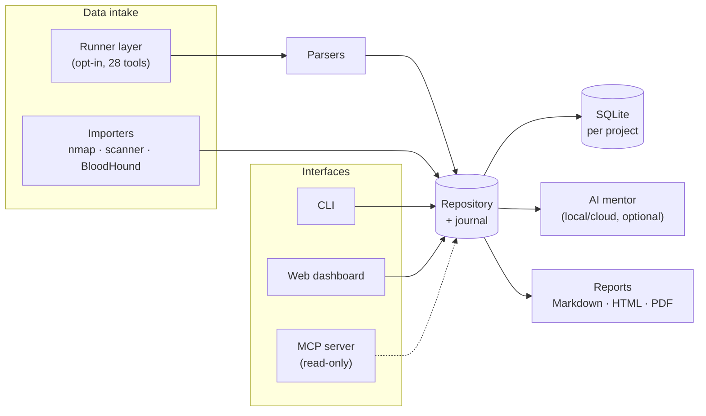

# PentOS

[🇩🇪 Deutsch](README.md) · **🇬🇧 English**

[](LICENSE)  

**Knowledge-Driven Offensive Security Workspace**

PentOS is **not a scanner collection**. It is a full pentest *workspace* system:
findings, attack paths, notes, evidence, knowledge and documentation are what it
revolves around. Local-first, no forced cloud, German-language output by default.
The AI is purely a learning and analysis assistant. **It never runs attacks or
commands itself**.

> Built for authorized testing: CTF, TryHackMe, bug bounty programs and signed-off engagements.

---

## What PentOS can do

Everything below is already shipped (✅) - open items are further down in the roadmap.

|  | Area | Core features |
|---|---|---|
| 🗂️ | **Workspace & docs** | Full project structure, automatic notes (`notes/nmap.md` etc.), timestamped pentest journal, task system, engagement timeline (milestones/windows/blackouts), bug-bounty scope policy (`policy setup`, blocks e.g. brute-force/exploitation per program rules), intelligent next steps (suggestions only) |
| 🔎 | **Recon & import** | nmap XML, scanner reports (Nessus/OpenVAS/Burp), BloodHound (SharpHound, on-prem AD) · automatic findings + structured parsers (enum4linux-ng, nuclei, gobuster/ffuf/feroxbuster, nikto, testssl.sh, httpx/naabu/dnsx, gitleaks) · guided chain `sweep`, scan diff · opt-in runner layer (28 tools, no shell eval, scope guard, optional proxychains pivot) |
| 🎯 | **Findings & attack path** | Severity/CVSS/EPSS (exploit likelihood, opt-in), MITRE ATT&CK technique tags + Navigator export, finding templates, status history/retest tracking, visual attack-path graph incl. BloodHound AD paths (Mermaid/Graphviz/SVG), loot/credential matching |
| 📊 | **Reporting & interfaces** | Markdown/branded HTML/PDF with risk score & chart · web dashboard (overview, finding/host detail view, command palette `Ctrl+K`) · MCP server for Claude Code/Cursor (read-only) |
| 🤖 | **AI mentor** | Advisor mode (optional `--act`: AI proposes a `pentos run` command, you pick and confirm each step yourself), "ask your project" (RAG, local embeddings), free language choice + auto model selection, offline fallback with no backend |
| 🧰 | **Around it** | Project export/import as a single file, default wordlists (`wordlists setup`), shell completion, evidence management, methodology/playbook library |

**Roadmap (open):**
- AzureHound support for the BloodHound import (schema research underway, see ROADMAP.en.md)
- AI flashcards & note summaries (from your own data only, no hallucination)
- Richer screenshot handling (e.g. direct capture/annotation)

The full roadmap, with rationale and deliberate non-goals, lives in [`ROADMAP.en.md`](ROADMAP.en.md).

---

## Installation

Four steps, copy-paste ready. Works the same on Kali/Debian/Ubuntu, macOS and
Windows.

**1) Get the repo** - `git clone` recommended (see the note below otherwise):
```bash
git clone https://github.com/kaldox/pentos.git
cd pentos
```

**2) Create and activate a virtual environment** - on modern systems (Kali,
Debian 12+, Ubuntu 23.04+, …) `pip` otherwise refuses to install with
`error: externally-managed-environment`. This is **not a Kali-specific
issue** - it's been the normal case since PEP 668, so this step isn't
optional, it's required:
```bash
python3 -m venv .venv
source .venv/bin/activate        # Linux/macOS
```
```powershell
python -m venv .venv
.venv\Scripts\Activate.ps1       # Windows (PowerShell)
```
Your terminal prompt should show `(.venv)` afterwards - only then does `pip`
actually install into the isolated environment instead of system-wide.

**3) Install:**
```bash
pip install -e ".[pdf,web,mcp]"   # recommended: with all extras
# lean, core CLI only, no PDF/web/MCP:
#   pip install -e .
```

**4) Check that it works:**
```bash
pentos --help
```
If a command overview shows up, you're done. `pentos` is now available inside
this (activated) virtual environment.

> **Important:** the venv must be activated again in **every new terminal
> session** (step 2, `source .venv/bin/activate` in the project folder) -
> otherwise the shell reports `pentos: command not found`. If that's
> annoying: trying to run `pip install -e .` without an active venv is
> exactly what causes `externally-managed-environment` - don't force it,
> activate the venv instead.

Without step 3 (`pip install -e .`), PentOS still runs via `python -m pentos ...`
as long as the venv is active and you're in the project folder (the one that
contains `pyproject.toml`).

On first start, `~/.config/pentos/config.yaml` is created automatically
(see `config.example.yaml`). Custom path via `export PENTOS_CONFIG=/path/config.yaml`.

### Common pitfalls

| Error message | Cause | Fix |
|---|---|---|
| `error: externally-managed-environment` | Step 2 (venv) skipped, or the venv isn't active (no `(.venv)` in the prompt) | `python3 -m venv .venv && source .venv/bin/activate`, then repeat step 3. **Don't** force it with `--break-system-packages`. |
| `ModuleNotFoundError: No module named 'pentos'` on `python -m pentos` | Wrong folder. With "Download ZIP" instead of `git clone`, the extracted folder is called `pentos-main`, and **inside it** there's also a `pentos/` subfolder (the Python source) - easy to mix up | Run `ls`: the correct folder contains `pyproject.toml` directly. If you're inside the inner `pentos/` subfolder: `cd ..` |
| `pentos: command not found` after restarting the terminal | The venv isn't active in the new session | Run `source .venv/bin/activate` in the project folder again (step 2) |
| `pip install -r requirements.txt` can't find the file | Wrong folder (see above) - also: `pip install -e ".[pdf,web,mcp]"` from step 3 fully replaces `requirements.txt` and is the recommended path | Switch to the correct folder, then step 3 as above |

---

## Quickstart

```bash
# 1) Create a project (becomes active automatically)
pentos project new THM_Alfred

# 2) Import a scan  (nmap -sC -sV -oX scan.xml <target>)
pentos scan import-nmap scan.xml          # or import-scanner for Nessus/OpenVAS/Burp
#   -> hosts + services + auto-tasks + auto-findings + auto-note

# 3) Overview & next steps
pentos dashboard                          # compact project overview
pentos recommend                          # project-wide run shortcuts across all services
pentos recommend 4                        # suggestions for a service (no execution)

# 4) Document your work
pentos finding status 4 confirmed
pentos loot add "admin:Passw0rd" --type cred --host 1 --source smb
pentos evidence add ./shot.png --kind screenshot --finding 4   # shows up in the report

# 5) Generate a report
pentos report --html                      # branded HTML (also --pdf, --explain)
```

That is the core flow. All commands grouped by area in the
**[command reference (COMMANDS.en.md)](COMMANDS.en.md)**, or live via `pentos --help`
and `pentos <group> --help` (e.g. `pentos finding --help`).

Alternative starting point without a ready-made scan - guided recon straight
against a target:
```bash
pentos project new demo
pentos scope add 10.10.10.0/24       # CIDR or hostname (e.g. box.thm)
pentos sweep 10.10.10.5 --run        # guided recon/enumeration
pentos template seed                 # pre-fill finding templates
```

---

## Runner layer (opt-in)

PentOS can also **run tools itself**, but only when you explicitly start them
(`pentos run <tool> <target>`). The raw output lands in `scans/`, gets parsed and
is automatically ingested into findings/tasks/evidence/notes and logged in the
journal. Some tools ingest their output directly: `nmap` builds the full
host/service/finding pipeline, `nuclei` creates findings, `hydra`/`nxc` write found
logins as loot, `enum4linux-ng` adds a structured note plus SMB findings.

> **Shell mode (`--shell`)**: By default tools run without a shell (fixed `argv`,
> no metacharacter eval, injection protection). Some tools need a real shell though
> (e.g. `smbclient -c '...'`); `--shell` enables that deliberately. The scope guard
> stays active. **Only use with trusted input.**

**Guided chain (`sweep`)** takes a target, runs base recon and then suggests the
next tools per discovered service. Rule-based, **not an autonomous agent**: safe
recon/enum tools can run automatically (with a prompt per step), brute-force/exploits
are **never** run automatically, only suggested.

**Playbooks** are checkable checklists (web, AD, Linux/Windows privesc) for a
structured approach; progress is saved per project. Add your own as YAML under
`~/.config/pentos/playbooks/`.

**"Ask your project" (RAG)** answers questions about your own project data with
source attribution, exclusively from the project context, no hallucination (local
embeddings via the AI backend).

**Scope guard:** for real engagements you define allowed targets so nothing runs
outside the engagement; without a scope the runner runs unrestricted (CTF mode).
Execution is always without a shell and with a per-tool timeout. PentOS runs nothing
on its own and chains no attacks automatically.

The concrete commands (tools, profiles, `sweep`, playbooks, RAG, scope) are in the
**[command reference (COMMANDS.en.md)](COMMANDS.en.md)**.

---

## AI configuration

Without a backend, everything runs in offline fallback. For real answers, connect
a backend, most easily via the CLI:

```bash
pentos ai config --provider ollama --base-url http://127.0.0.1:11434 --model llama3.1
pentos ai status          # checks reachability + lists models
```

Providers: `ollama` | `lmstudio` | `openai` | `none`. Reasoning models (e.g.
`deepseek-r1`) are supported; PentOS strips their internal `<think>…</think>`
blocks from the answer.

An optional OpenAI key is **never** stored in the config; it is only read from
the environment variable named in `api_key_env` (the default AI is local
Ollama, running entirely without a cloud connection).

**Reaching Ollama from a VM:** have Ollama listen on the network on the host
(`OLLAMA_HOST=0.0.0.0:11434 ollama serve`), open port 11434 in the firewall, and
set `--base-url http://<host-ip>:11434` inside the VM. Bridged or host-only
networking works directly; with plain NAT you may need port forwarding.

---

## Architecture



```
pentos/
├── models.py          # Pydantic models + enums (Severity, Status, ...)
├── config.py          # YAML config, paths, active project
├── workspace.py       # workspace folder structure
├── db.py              # SQLite schema (one DB per project)
├── repository.py      # CRUD + automatic journal logging
├── recommend.py       # rule engine: service -> recommendations + auto-tasks
├── findings_rules.py  # auto-finding detectors (incl. NSE output)
├── importers/nmap.py  # nmap XML parser
├── runners/           # opt-in tool execution
│   ├── base.py        #   safe execution (no shell, timeout) + ToolSpec
│   ├── registry.py    #   declarative tool definitions
│   └── parsers.py     #   ingest: output -> findings/tasks/evidence/notes
├── graph.py           # attack path -> Mermaid / Graphviz DOT
├── report.py          # Markdown report
├── ai.py              # AI mentor (Ollama/LM Studio/OpenAI + offline fallback)
└── cli/app.py         # Typer CLI (Rich output)
```

Data model: one SQLite DB per project under `<project>/database/pentos.db`.

---

## Security / scope

PentOS orchestrates and documents. It runs **no** scans or exploits itself.
Recommendations are suggestions, the AI analyzes only. Use only in authorized
environments (your own labs, CTF/THM, signed-off tests).

---

## Tests

```bash
pip install pytest
pytest -q
```

---

## ⚠️ Disclaimer / Authorized Use Only

PentOS is intended solely for **authorized** security testing: your own labs,
CTF platforms like TryHackMe/Hack The Box, and engagements with **written
permission** from the target owner. Use against systems without explicit permission
is a criminal offense in most jurisdictions.

The authors accept **no liability** for misuse or damage. Use at your own risk. The
tool **runs no attacks itself** and the integrated AI **only analyzes**; responsibility
for every executed action lies with the user.

---

## License

Released under the [MIT License](LICENSE). Contributions welcome - see
[`CONTRIBUTING.md`](CONTRIBUTING.md). Found a security issue in PentOS
itself? Please [report it privately](SECURITY.md), not as an issue.

---

## Web dashboard (optional)

A local situational overview of your workspace in the browser: severity distribution,
findings, hosts/services, loot and notes at a glance.

Already installed if you followed the recommended `pip install -e ".[pdf,web,mcp]"`
above - otherwise add it:
```bash
pip install -e ".[web]"          # FastAPI + uvicorn
pentos serve                     # starts http://127.0.0.1:8787
pentos serve --port 9000 --project myproject
```

In the dashboard you can **change a finding's status** and **add notes**; the changes
go straight into the project. It binds to `127.0.0.1` only by default (**no open attack
surface**). Every start generates a random token, printed only in the terminal - open
exactly the printed link (with `?token=...`), otherwise every API request (including
reads, because of loot/credentials) gets rejected with 401. Binding to a `--host` other
than `127.0.0.1`/`localhost` triggers an explicit warning and confirmation, since the
dashboard then becomes reachable over the network (`--yes` skips the prompt).

---

## MCP server (optional)

Makes the PentOS workspace queryable from MCP clients like **Claude Code** or **Cursor**.
You talk to your project in natural language ("show the high findings", "what is in the
SMB notes"). All MCP tools are **strictly read-only/analytical**; no tool runs scans or
attacks. The heavy reasoning happens in the client, control stays with you.

Already installed if you used all extras above - otherwise add it:
```bash
pip install -e ".[mcp]"
```

Client configuration (example, e.g. in the client's MCP settings file):

```json
{ "mcpServers": { "pentos": { "command": "pentos", "args": ["mcp"] } } }
```

Provided tools: `pentos_list_projects`, `pentos_summary`, `pentos_findings`,
`pentos_hosts`, `pentos_loot`, `pentos_notes`, `pentos_knowledge`.

---

## Changelog

All versions and changes are documented in [`CHANGELOG.en.md`](CHANGELOG.en.md).
Current version: **2.41.0**.
