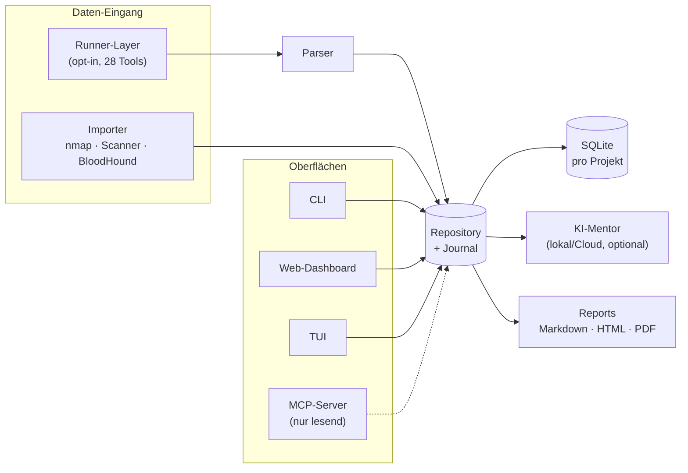

# PentOS

**🇩🇪 Deutsch** · [🇬🇧 English](README.en.md)

[](LICENSE)  

**Knowledge-Driven Offensive Security Workspace**

PentOS ist **keine Scanner-Sammlung**, sondern ein vollständiges Pentest-*Workspace*-System:
Erkenntnisse, Angriffspfade, Notizen, Beweise, Wissen und Dokumentation stehen im
Mittelpunkt. Lokal-first, kein Cloud-Zwang, deutschsprachige Ausgabe. Die KI ist reiner
Lern- und Analyseassistent. **Sie führt niemals selbst Angriffe oder Befehle aus.**

> Gedacht für autorisiertes Testing: CTF, TryHackMe, Bug-Bounty-Programme und freigegebene Engagements.

---

## Was PentOS kann

Alles unten ist bereits umgesetzt (✅) — offene Punkte stehen weiter unten in der Roadmap.

|  | Bereich | Kernfunktionen |
|---|---|---|
| 🗂️ | **Workspace & Doku** | Vollständige Projektstruktur, automatische Notizen (`notes/nmap.md` etc.), Pentest-Journal mit Zeitstempel, Aufgabensystem, Engagement-Zeitplan (Meilensteine/Zeitfenster/Blackout), Programm-Regeln fürs Bug-Bounty-Scope (`policy setup`, sperrt z.B. Brute-Force/Exploitation nach Programm-Policy), intelligente nächste Schritte (nur Vorschläge) |
| 🔎 | **Recon & Import** | nmap-XML, Scanner-Reports (Nessus/OpenVAS/Burp), BloodHound (SharpHound, on-prem AD) · automatische Findings + strukturierte Parser (enum4linux-ng, nuclei, gobuster/ffuf/feroxbuster, nikto, testssl.sh, httpx/naabu/dnsx, gitleaks) · geführte Kette `sweep`, Scan-Diff · opt-in Runner-Layer (28 Tools, kein Shell-Eval, Scope-Guard, optionaler Proxychains-Pivot) |
| 🎯 | **Findings & Angriffspfad** | Severity/CVSS/EPSS (Ausnutzungswahrscheinlichkeit, opt-in), MITRE-ATT&CK-Technique-Tags + Navigator-Export, Finding-Templates, Status-Historie/Retest-Tracking, visueller Angriffspfad-Graph inkl. BloodHound-AD-Pfaden (Mermaid/Graphviz/SVG), Loot-/Credential-Matching |
| 📊 | **Reporting & Oberflächen** | Markdown/gebrandetes HTML/PDF mit Risk-Score & Chart · Web-Dashboard (Lagebild, Finding-/Host-Detailansicht, Command Palette `Strg+K`) · Terminal-UI · Obsidian-Vault-Export · MCP-Server für Claude Code/Cursor (nur lesend) |
| 🤖 | **KI-Mentor** | Advisor-Modus (optional mit `--act`: KI schlägt einen `pentos run`-Befehl vor, du wählst und bestätigst jeden Schritt einzeln), „Frag dein Projekt" (RAG, lokale Embeddings), Vision (Screenshot-Analyse), freie Sprachwahl + Auto-Modellwahl, Offline-Fallback ohne Backend |
| 🧰 | **Drumherum** | Projekt-Export/-Import als eine Datei, Standard-Wordlists + kuratierter SecLists-Katalog (`wordlists setup`/`catalog`/`add`), Shell-Completion, Evidence-Management, CTF/THM-Wissensdatenbank, Methodik-/Playbook-Bibliothek |

**Roadmap (offen):**
- AzureHound-Unterstützung für den BloodHound-Import (Schema-Recherche läuft, siehe ROADMAP.md)
- KI-Lernkarten & Notizen-Zusammenfassungen (nur aus eigenen Daten, ohne Halluzination)
- Reicheres Screenshot-Handling (z.B. direkte Aufnahme/Annotation)

Die vollständige Roadmap mit Begründungen und bewussten Nicht-Zielen steht in [`ROADMAP.md`](ROADMAP.md).

---

## Installation

Vier Schritte, kopierbar. Funktioniert identisch auf Kali/Debian/Ubuntu, macOS
und Windows.

**1) Repo herunterladen** — `git clone` empfehlenswert (sonst siehe Hinweis unten):
```bash
git clone https://github.com/kaldox/pentos.git
cd pentos
```

**2) Virtuelle Umgebung anlegen und aktivieren** — auf modernen Systemen
(Kali, Debian 12+, Ubuntu 23.04+, …) verweigert `pip` die Installation sonst mit
`error: externally-managed-environment`. Das ist **kein Kali-spezifisches Problem**,
sondern seit PEP 668 der Normalfall — dieser Schritt ist deshalb kein „Extra",
sondern Pflicht:
```bash
python3 -m venv .venv
source .venv/bin/activate        # Linux/macOS
```
```powershell
python -m venv .venv
.venv\Scripts\Activate.ps1       # Windows (PowerShell)
```
Der Zeilenanfang deines Terminals zeigt danach `(.venv)` — nur dann installiert
`pip` auch wirklich in die isolierte Umgebung statt ins System.

**3) Installieren:**
```bash
pip install -e ".[pdf,web,mcp,tui]"   # empfohlen: mit allen Extras
# schlank, nur die Kern-CLI ohne PDF/Web/MCP/TUI:
#   pip install -e .
```

**4) Prüfen, ob es funktioniert:**
```bash
pentos --help
```
Erscheint eine Befehlsübersicht, ist die Installation fertig. `pentos` steht ab
jetzt in dieser (aktivierten) virtuellen Umgebung zur Verfügung.

> **Wichtig:** Das venv muss in **jeder neuen Terminal-Sitzung** erneut aktiviert
> werden (Schritt 2, `source .venv/bin/activate` im Projektordner) — sonst meldet
> die Shell `pentos: command not found`. Wer das lästig findet: `pip install -e .`
> auch ohne aktives venv ausführen zu wollen ist genau der Fehler, der zu
> `externally-managed-environment` führt — nicht erzwingen, sondern das venv
> aktivieren.

Ohne Schritt 3 (`pip install -e .`) läuft PentOS trotzdem via `python -m pentos ...`,
solange das venv aktiv ist und man sich im Projektordner befindet (dem, der
`pyproject.toml` enthält).

Beim ersten Start wird `~/.config/pentos/config.yaml` automatisch angelegt
(siehe `config.example.yaml`). Eigener Pfad via `export PENTOS_CONFIG=/pfad/config.yaml`.

### Typische Stolpersteine

| Fehlermeldung | Ursache | Lösung |
|---|---|---|
| `error: externally-managed-environment` | Schritt 2 (venv) übersprungen, oder venv nicht aktiviert (kein `(.venv)` im Prompt) | `python3 -m venv .venv && source .venv/bin/activate`, dann Schritt 3 wiederholen. **Nicht** mit `--break-system-packages` erzwingen. |
| `ModuleNotFoundError: No module named 'pentos'` bei `python -m pentos` | Falscher Ordner. Bei „Download ZIP" statt `git clone` heisst der entpackte Ordner `pentos-main`, und **darin** liegt zusätzlich ein Unterordner `pentos/` (der Python-Quellcode) — leicht zu verwechseln | `ls` ausführen: der richtige Ordner enthält `pyproject.toml` direkt. Falls man im inneren `pentos/`-Unterordner steht: `cd ..` |
| `pentos: command not found` nach einem Neustart des Terminals | Venv ist in der neuen Sitzung nicht aktiv | `source .venv/bin/activate` im Projektordner erneut ausführen (Schritt 2) |
| `pip install -r requirements.txt` findet die Datei nicht | Falscher Ordner (siehe oben) — ausserdem: `pip install -e ".[pdf,web,mcp,tui]"` aus Schritt 3 ersetzt `requirements.txt` vollständig und ist der empfohlene Weg | In den richtigen Ordner wechseln, dann Schritt 3 wie oben |

---

## Quickstart

```bash
# 1) Projekt anlegen (wird automatisch aktiv)
pentos project new THM_Alfred

# 2) Scan importieren  (nmap -sC -sV -oX scan.xml <ziel>)
pentos scan import-nmap scan.xml          # oder import-scanner für Nessus/OpenVAS/Burp
#   -> Hosts + Services + Auto-Aufgaben + Auto-Findings + Auto-Notiz

# 3) Überblick & nächste Schritte
pentos dashboard                          # kompakte Projekt-Übersicht
pentos recommend 4                        # Vorschläge für einen Service (keine Ausführung)

# 4) Arbeiten dokumentieren
pentos finding status 4 confirmed
pentos loot add "admin:Passw0rd" --type cred --host 1 --source smb
pentos evidence add ./shot.png --kind screenshot --finding 4   # erscheint im Report

# 5) Report erzeugen
pentos report --html                      # gebrandetes HTML (auch --pdf, --explain)
```

Das ist der Kern-Ablauf. Alle Befehle nach Bereich gruppiert in der
**[Befehls-Referenz (COMMANDS.md)](COMMANDS.md)**, oder live über `pentos --help`
und `pentos <gruppe> --help` (z.B. `pentos finding --help`).

Alternative für den Einstieg ohne fertigen Scan — geführte Recon direkt gegen
ein Ziel:
```bash
pentos project new demo
pentos scope add 10.10.10.0/24       # CIDR oder Hostname (z.B. box.thm)
pentos sweep 10.10.10.5 --run        # geführte Recon/Enumeration
pentos template seed                 # Finding-Vorlagen vorbefüllen
```

Der **Advisor-Modus** (Standard an) macht die KI proaktiv: konkrete nächste Schritte
mit Begründung und vorgeschlagenen Befehlen, die du prüfst und selbst startest. Die KI
**führt nie selbst etwas aus**. Vor jedem Senden fragt PentOS nach; geht es an einen
Cloud-Anbieter, warnt es ausdrücklich, dass Daten den Rechner verlassen (lokales Ollama
bleibt dagegen privat). Umschalten: `pentos ai config --advisor / --no-advisor`.

---

## Runner-Layer (opt-in)

PentOS kann Tools auch **selbst ausführen**, aber nur, wenn du sie explizit
startest (`pentos run <tool> <ziel>`). Die Rohausgabe landet in `scans/`, wird
geparst und automatisch in Findings/Tasks/Evidence/Notizen überführt und im
Journal protokolliert. Einige Tools werten ihre Ausgabe direkt aus: `nmap` baut
die volle Host/Service/Finding-Pipeline, `nuclei` erzeugt Findings, `hydra`/`nxc`
schreiben gefundene Logins als Loot, `enum4linux-ng` legt eine strukturierte Notiz
plus SMB-Findings an.

> **Shell-Modus (`--shell`)**: Standardmäßig laufen Tools ohne Shell (festes `argv`,
> kein Metazeichen-Eval, Injection-Schutz). Manche Tools brauchen aber eine echte
> Shell (z.B. `smbclient -c '...'`); `--shell` aktiviert das bewusst. Der Scope-Guard
> bleibt aktiv. **Nur mit vertrauenswürdiger Eingabe verwenden.**

**Geführte Kette (`sweep`)** nimmt ein Ziel, startet die Basis-Recon und schlägt pro
Dienst die nächsten Tools vor. Regelbasiert, **kein autonomer Agent**: sichere
Recon/Enum-Tools können automatisch laufen (mit Rückfrage je Schritt),
Brute-Force/Exploits werden **nie** automatisch ausgeführt, nur vorgeschlagen.

**Playbooks** sind abhakbare Checklisten (Web, AD, Linux-/Windows-PrivEsc) für
strukturiertes Vorgehen; der Fortschritt wird pro Projekt gespeichert. Eigene als
YAML unter `~/.config/pentos/playbooks/`.

**„Frag dein Projekt" (RAG)** beantwortet Fragen über die eigenen Projektdaten mit
Quellenangabe, ausschließlich aus dem Projektkontext, ohne Halluzination (lokale
Embeddings über das KI-Backend).

**Scope-Guard:** Für echte Engagements legst du erlaubte Ziele fest, damit nichts
außerhalb des Auftrags läuft; ohne Scope läuft der Runner uneingeschränkt (CTF-Modus).
Ausführung erfolgt immer ohne Shell und mit Timeout je Tool. PentOS führt nichts von
selbst aus und kettet keine Angriffe automatisch.

Die konkreten Befehle (Tools, Profile, `sweep`, Playbooks, RAG, Scope) stehen in der
**[Befehls-Referenz (COMMANDS.md)](COMMANDS.md)**.

---

## KI konfigurieren

Ohne Backend läuft alles im Offline-Fallback. Für echte Antworten ein Backend
anbinden, am einfachsten per CLI:

```bash
pentos ai config --provider ollama --base-url http://127.0.0.1:11434 --model llama3.1
pentos ai status          # prüft Erreichbarkeit + listet Modelle
```

Provider: `ollama` | `lmstudio` | `openai` | `none`. Reasoning-Modelle (z.B.
`deepseek-r1`) werden unterstützt; ihre internen `<think>…</think>`-Blöcke filtert
PentOS aus der Antwort.

Ein optionaler OpenAI-Key wird **nie** in der Config gespeichert, sondern nur über
die in `api_key_env` genannte Umgebungsvariable gelesen (Default-KI ist lokales
Ollama, läuft komplett ohne Cloud-Anbindung).

**Ollama aus einer VM erreichen:** Ollama auf dem Hauptrechner im Netz lauschen
lassen (`OLLAMA_HOST=0.0.0.0:11434 ollama serve`), Port 11434 in der Firewall
freigeben und in der VM `--base-url http://<hauptrechner-ip>:11434` setzen.
Bridged- oder Host-only-Netz funktioniert direkt; bei reinem NAT ggf.
Port-Forwarding.

---

## Architektur



```
pentos/
├── models.py          # Pydantic-Modelle + Enums (Severity, Status, ...)
├── config.py          # YAML-Config, Pfade, aktives Projekt
├── workspace.py       # Workspace-Ordnerstruktur
├── db.py              # SQLite-Schema (eine DB pro Projekt)
├── repository.py      # CRUD + automatisches Journal-Logging
├── recommend.py       # Regel-Engine: Service -> Empfehlungen + Auto-Tasks
├── findings_rules.py  # Auto-Finding-Detektoren (inkl. NSE-Output)
├── importers/nmap.py  # nmap-XML-Parser
├── runners/           # Opt-in Tool-Ausführung
│   ├── base.py        #   sichere Ausführung (kein Shell, Timeout) + ToolSpec
│   ├── registry.py    #   deklarative Tool-Definitionen
│   └── parsers.py     #   Ingest: Ausgabe -> Findings/Tasks/Evidence/Notizen
├── graph.py           # Attack-Path -> Mermaid / Graphviz-DOT
├── obsidian.py        # Vault-Export mit Wikilinks
├── report.py          # Markdown-Report
├── ai.py              # KI-Mentor (Ollama/LM Studio/OpenAI + Offline-Fallback)
└── cli/app.py         # Typer-CLI (Rich-Ausgabe, deutsch)
```

Datenmodell: pro Projekt eine eigene SQLite-DB unter `<projekt>/database/pentos.db`.

---

## Sicherheit / Scope

PentOS orchestriert und dokumentiert. Es führt **keine** Scans oder Exploits selbst aus.
Empfehlungen sind Vorschläge, die KI analysiert ausschliesslich. Einsatz nur in
autorisierten Umgebungen (eigene Labs, CTF/THM, freigegebene Tests).

---

## Tests

```bash
pip install pytest
pytest -q
```

---

## ⚠️ Haftungsausschluss / Authorized Use Only

PentOS ist ausschliesslich für **autorisierte** Sicherheitstests gedacht: eigene Labore,
CTF-Plattformen wie TryHackMe/Hack The Box sowie Engagements mit **schriftlicher
Genehmigung** des Zielinhabers. Der Einsatz gegen Systeme ohne ausdrückliche Erlaubnis ist
in den meisten Rechtsordnungen strafbar.

Die Autorinnen und Autoren übernehmen **keine Haftung** für Missbrauch oder Schäden. Die
Nutzung erfolgt auf eigene Verantwortung. Das Tool **führt selbst keine Angriffe aus** und
die integrierte KI **analysiert ausschliesslich**. Die Verantwortung für jede ausgeführte
Aktion liegt bei der nutzenden Person.

---

## Lizenz

Veröffentlicht unter der [MIT-Lizenz](LICENSE). Beiträge willkommen –
siehe [`CONTRIBUTING.md`](CONTRIBUTING.md). Sicherheitslücke in PentOS
selbst gefunden? Bitte [privat melden](SECURITY.md), nicht als Issue.

---

## Web-Dashboard (optional)

Ein lokales Lagebild deines Workspace im Browser: Severity-Verteilung, Findings,
Hosts/Dienste, Loot und Notizen auf einen Blick.

Bereits installiert, falls du wie oben empfohlen mit `pip install -e ".[pdf,web,mcp,tui]"`
installiert hast — sonst nachrüsten:
```bash
pip install -e ".[web]"          # FastAPI + uvicorn
pentos serve                     # startet http://127.0.0.1:8787
pentos serve --port 9000 --project meinprojekt
```

Im Dashboard kannst du den **Status von Findings ändern** und **Notizen anlegen**;
die Änderungen landen direkt im Projekt. Es bindet standardmässig nur an `127.0.0.1`
(**keine offene Angriffsfläche**); Schreibzugriffe sind zusätzlich per Origin-Prüfung
gegen Drive-By-Zugriffe fremder Websites geschützt.

---

## MCP-Server (optional)

Macht den PentOS-Workspace für MCP-Clients wie **Claude Code** oder **Cursor**
abfragbar – du sprichst dein Projekt in natürlicher Sprache an („zeig die
High-Findings", „was steht in den Notizen zu SMB"). Alle MCP-Tools sind
**ausschliesslich lesend/analysierend** – kein Tool führt Scans oder Angriffe
aus. Das grosse Reasoning übernimmt der Client, die Kontrolle bleibt bei dir.

Bereits installiert, falls du mit allen Extras installiert hast — sonst nachrüsten:
```bash
pip install -e ".[mcp]"
```

Client-Konfiguration (Beispiel, z.B. in der MCP-Settings-Datei des Clients):
```json
{ "mcpServers": { "pentos": { "command": "pentos", "args": ["mcp"] } } }
```

Bereitgestellte Tools: `pentos_list_projects`, `pentos_summary`, `pentos_findings`,
`pentos_hosts`, `pentos_loot`, `pentos_notes`, `pentos_knowledge`.

---

## TUI – Terminal-Oberfläche (optional)

`pentos tui` öffnet ein tastaturgesteuertes Lagebild des aktiven Projekts direkt
im Terminal. Tabs für Übersicht, Hosts, Dienste, Findings, Tasks, Loot und
Journal; Navigation mit Pfeiltasten und Tab. Mit `s` schaltest du den Status des
markierten Findings oder Tasks weiter (das wird ins Projekt geschrieben), `r`
aktualisiert, `q` beendet. Reine Ansicht und Status-Pflege, es wird nichts
ausgeführt.

Bereits installiert, falls du mit allen Extras installiert hast — sonst nachrüsten:
```bash
pip install -e ".[tui]"
pentos tui                 # oder: pentos tui --project meinprojekt
```

---

## Changelog

Alle Versionen und Änderungen sind in [`CHANGELOG.md`](CHANGELOG.md) dokumentiert.
Aktuelle Version: **2.37.0**.
